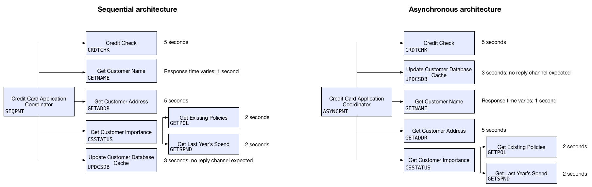

# Asynchronous vs. sequential processing and the CICS Asynchronous API

Having introduced the [CICS Asynchronous API][prad] and given you a [basic example][chris] of how it works, now we're going to illustrate the potential of asynchronous processing -- and its benefits compared to traditional sequential processing -- by talking through an example which runs the same credit check application both sequentially and asynchronously. Spoilers: the asynchronous version completes almost twice as fast as the sequential version!

The source code for this example is available in full on [GitHub][github], where you'll find our two parent programs, `ASYNCPNT` and `SEQPNT`, and instructions for running them from a CICS terminal. Rather than do a step-by-step tutorial, in this article we're going to examine how they differ, and how a few small architecture changes can make a massive difference to your response times.

This particular example simulates a real-world scenario: a customer applies for a credit card, and a program kicks off to check their name, details, and history. Each check has its own program and associated transaction in CICS: `SEQPNT` calls the involved programs using `EXEC CICS LINK`, and `ASYNCPNT` uses the new `EXEC CICS RUN TRANSID` command. The child programs take the same amount of time to complete in both `ASYNCPNT` and `SEQPNT`, but `ASYNCPNT` finishes in roughly half the time thanks to the asynchronous API.

**What `ASYNCPNT` looks like**

## Getting it done: all at once or bit by bit

The fundamental difference between asynchronous and sequential processing is, simply put, how much you can do at once. Traditional sequential processing only allows you to perform one action at a time, then you have to wait for it to complete (successfully or otherwise) before you can do something else. If one of your actions hangs, or the external service it's calling is being slow, then the delays stack up quickly. The main body of our sequential `SEQPNT` program works this way, calling programs one by one using `EXEC CICS LINK` and waiting for them to complete before retrieving data from them using `EXEC CICS GET CONTAINER` (we're using containers to store and retrieve data):

    EXEC CICS LINK PROGRAM ( CREDIT-CHECK )
                     CHANNEL ( MYCHANNEL )
                     RESP    ( COMMAND-RESP )
                     RESP2   ( COMMAND-RESP2 )
    END-EXEC

    EXEC CICS GET CONTAINER (CRDTCHK-CONTAINER)
                    INTO    (CREDIT-CHECK-RESULT)
                    CHANNEL (MYCHANNEL)
                    RESP    (COMMAND-RESP)
                    RESP2   (COMMAND-RESP2)
    END-EXEC

And so on for the other programs we need to run, calling and waiting, calling and waiting.

Our `ASYNCPNT` program, however, looks more like this:

    EXEC CICS RUN TRANSID      (CREDIT-CHECK-TRAN)
                    ASYNCHRONOUS
                    CHANNEL      (MYCHANNEL)
                    CHILD        (CREDIT-CHECK-TKN)
    END-EXEC

    EXEC CICS RUN TRANSID      (GET-ADDR-TRAN)
                    ASYNCHRONOUS
                    CHANNEL      (MYCHANNEL)
                    CHILD        (GET-ADDR-TKN)
    END-EXEC

    EXEC CICS RUN TRANSID      (CSSTATUS-TRAN)
                    ASYNCHRONOUS
                    CHANNEL      (MYCHANNEL)
                    CHILD        (CSSTATUS-TKN)
    END-EXEC

Using the `EXEC CICS RUN TRANSID` command, we can kick off multiple programs at once, and they'll run as child transactions of the parent program (see [Prad's article][prad] for a more detailed breakdown of how parents and child programs interact). Child transactions run separately to the parent program, much like real children, allowing the parent program to continue with anything else it wants to do in the meantime, just like real parenting, right? Child tasks will always run locally to the parent task (that is, in the same CICS region).

## Getting results

Getting results in a sequential processing model is as simple as waiting, and waiting, and waiting, because your parent program is blocked until its child program completes (sounding more and more like real parenthood, isn't it?). In our asynchronous model, the parent program logic continues until we decide it's time to find out what the kids are up to. Using the `EXEC CICS FETCH CHILD` command, we can check on the completion status and abend code of any child transaction:

    EXEC CICS FETCH CHILD       (CREDIT-CHECK-TKN)
                      CHANNEL     (CREDIT-CHECK-CHAN)
                      COMPSTATUS  (CHILD-RETURN-STATUS)
                      ABCODE      (CHILD-RETURN-ABCODE)
    END-EXEC

Our credit check application doesn't have any logic that checks if a child transaction completed successfully, which is very bad of us (don't try this at home, kids), but the response received from a `FETCH CHILD` command includes completion status and abend code, so you can (and should) ensure that your child transaction was happy and successful.

Once the `FETCH CHILD` command has completed, we can go ahead and retrieve the results of the child transaction using an `EXEC CICS GET CONTAINER` command, just the same as we would for sequential processing:

    EXEC CICS GET CONTAINER (CRDTCHK-CONTAINER)
                    INTO    (CREDIT-CHECK-RESULT)
                    CHANNEL (CREDIT-CHECK-CHAN)
                    RESP    (COMMAND-RESP)
                    RESP2   (COMMAND-RESP2)
    END-EXEC

## Parent and child communication

Passing data between parent and child tasks is handled using channels and their containers. When a child task is started using `EXEC CICS RUN TRANSID`, it will be passed a copy of the channel specified in the command, as well as a copy of all the channel's containers (and the data within them). As it runs, the child task will update the data in its copy of the channel, while the parent program can continue processing using the original channel - this is what allows the two (or more) tasks to run asynchronously.

Sometimes you won't even need to use containers: if all you need to know is the completion status of your child tasks, then the `EXEC CICS FETCH CHILD` command will give you all the information you need.

## Know thy children, know thyself

By using the CICS Asynchronous API, you can reduce unnecessary wait times in an application -- if you know where your bottlenecks are. Making the most of this new functionality means thinking about your transactions in a new -- and exciting! -- way: what can be run concurrently, what's independent, what can I start now and finish later? By slicing and dicing program call and response in this way, it's possible to create a whole new class of responsive, fast applications.

For more information on the nuts and bolts of the CICS Asynchronous API, head over to the [IBM Knowledge Center][kc].

[prad]: https://developer.ibm.com/cics/2016/07/22/introducing-asynchronous-api/
[kc]: https://www.ibm.com/support/knowledgecenter/SSGMCP_5.4.0/fundamentals/asynchronous/async-api.html?pos=2
[chris]: https://developer.ibm.com/cics/2016/07/25/how-to-use-the-cics-asynchronous-api-commands/
[github]: https://github.com/cicsdev/cics-async-api-credit-card-application-example
